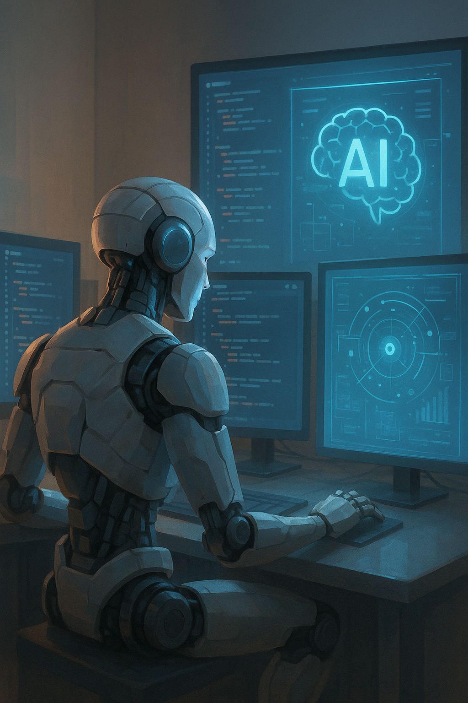

# 🧠 AIDD 30-Day Challenge — Task 1: Understanding AI-Driven Development and Human–AI Collaboration

---

## 👤 Name: Mohummad Anees (CO-ordinator)

## 🎓 Roll Number: [00231706]

---

# Reflection Questions

### **Q1: What does AI-Driven Development mean to you?**

### **Q2: How do you see the future of Human–AI Collaboration in software development?**

---

# Answers

## **Q1: What does AI-Driven Development mean to you?**

AI-Driven Development (AIDD) is not just a new way of writing code; it’s a **complete paradigm shift in software development**. It emphasizes collaboration between developers and AI systems to accelerate, enhance, and optimize the entire development workflow.

Reflecting on my journey: I began coding in **2022**, long before ChatGPT was launched. At that time, even resolving simple errors in **C language** required hours of research on YouTube. A single concept could take **1.5 hours** to understand and test. My first IDE experience was **Turbo C++**, later transitioning to **VS Code** for a more modern workflow.

When ChatGPT launched later in 2022, it drastically changed my workflow. Platforms like **TryIt** helped me write Arduino code, and I even won an **IoT competition**, ranking 1st across Sindh. This experience highlighted how AI can amplify human creativity and efficiency.

Later, I explored **frontend development** and gradually moved into **backend development**. Building a **MERN stack application manually** — without generator packages — was challenging. Even creating a simple MVC architecture could take **30 minutes to 1 hour** for a beginner. Using **Speckit Plus** and **Gemini CLI**, I learned that effective **prompt writing** is key — AI does the heavy lifting while I focus on reasoning, validation, and architecture.

**In essence:** AIDD transforms the developer from a coder into a creator, from an executor into a collaborator, combining human judgment with AI speed and capability.

---

## **Q2: How do you see the future of Human–AI Collaboration in software development?**

The future of software development lies in **co-piloting with AI**. Humans provide reasoning, context, and strategy, while AI handles repetitive, complex, or time-consuming tasks.

From my personal 3-year learning journey:

* Starting with **Turbo C++** in 2022
* Moving to **VS Code** and exploring modern IDEs
* First exposure to AI via **ChatGPT**
* Winning the **IoT Arduino competition**
* Frontend and backend development in **MERN stack** manually
* Exploring **Speckit Plus** and **Gemini CLI**

This journey taught me that coding is not just about syntax; it’s about **problem-solving, reasoning, and evaluation**. AI allows non-technical people to create systems faster, but those with technical experience can **amplify their expertise**, making collaboration more effective.

In the future, developers will act as **strategists and evaluators**, while AI becomes the operational assistant. Success will depend on **prompt writing skills, reasoning, and ability to refine AI outputs**. Human–AI collaboration will democratize software development, increase creativity, and make building complex applications accessible to more people.

---

# 🧠 Self-Test (MCQs with Correct Answers)

1️⃣ **What is the main purpose of the AI-Native Era?**
✔ **b) Empower developers through AI tools**

2️⃣ **What defines an AI-driven developer?**
✔ **b) Creates context-aware prompts**

3️⃣ **What does “AIDD” stand for?**
✔ **b) AI-Driven Development**

4️⃣ **What is the focus of Evaluation-Driven Development (EvDD)?**
✔ **b) Evaluating and improving AI outputs**

5️⃣ **What should developers focus on in the AI era?**
✔ **b) Building reasoning + evaluation skills**

